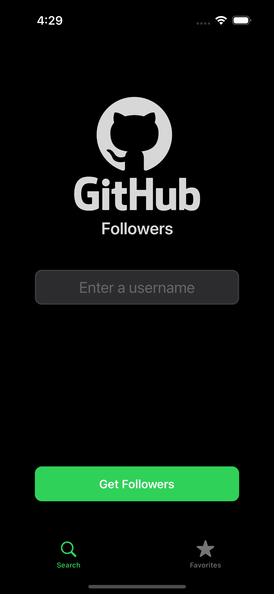
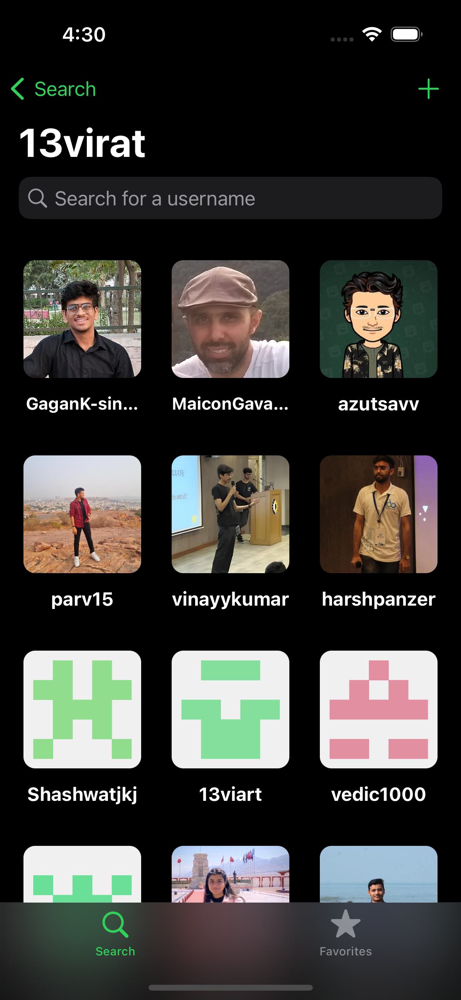
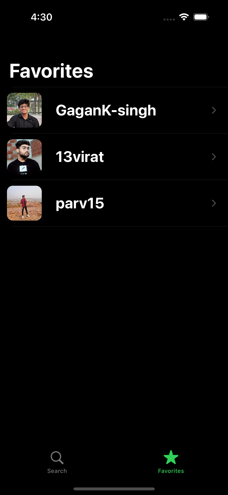

# GitHub Followers — iOS (Programmatic UIKit)

A polished iOS app built 100% with programmatic UIKit. The app fetches followers for any GitHub username, supports pagination, and lets users add a GitHub profile to Favorites (persisted locally). Designed to showcase modern UIKit development practices.
---

## Demo

> Replace with your own media when ready.

- **Video Walkthrough:** `Assets/demo.mp4`
- **Screenshots:** `Assets/screenshots/`

| Search | Followers (Pagination) | Favorites |
|---|---|---|
|  |  |  |

---

## Highlights

- **100% Programmatic UI** (UIKit)
- **Collection View** with **Pagination** and **Diffable Data Source**
- **Embedded View Controllers** for modular composition
- **Native Image Caching** via `NSCache`
- **Custom Alert View** (UIKit) for reusable system‑like alerts
- **Dark Mode** + **Dynamic Type** + **VoiceOver** labels
- **iPhone SE** layout support (Auto Layout‑friendly)
- **Networking** with `URLSession` and `Codable`
- **Persistence** via `UserDefaults` (Favorites)
- **Modern Swift error handling** using `Result` and typed errors
- **No 3rd‑party libraries**
- **Updated for iOS 15, 16, and 17**

---

## Tech Stack

- **Language:** Swift 5
- **UI:** UIKit (programmatic Auto Layout)
- **Data:** URLSession, Codable, JSON
- **Storage:** UserDefaults via a Persistence Manager
- **Caching:** NSCache (in‑memory image cache)
- **Architecture:** MVC(+C) with Coordinators/Delegates for flow and communication

---

## Architecture Overview

- **View Controllers** render screens and own their views programmatically.
- **Views** are custom `UIView` subclasses (no storyboards/xibs).
- **NetworkManager** handles requests, decoding with `Codable`, and error mapping.
- **ImageLoader** wraps image download + `NSCache` logic.
- **PersistenceManager** abstracts `UserDefaults` reads/writes (Favorites).
- **Protocols & Delegates** decouple communication (e.g., search → results, cells → controllers).
- **Diffable Data Source** drives collection updates and pagination inserts smoothly.

```text
App
├─ Scenes
│  ├─ Search
│  ├─ FollowersList
│  └─ Favorites
├─ Common
│  ├─ CustomUI (Buttons, TextFields, EmptyState, Alerts)
│  ├─ Networking (NetworkManager, Endpoints, Models)
│  ├─ Persistence (PersistenceManager, Keys)
│  ├─ ImageCache (ImageLoader, NSCache)
│  └─ Utilities (Extensions, Constants)
└─ Resources (Assets, AppIcons)
```

---

## How It Works

### Fetching Followers
- Builds the request to `GET https://api.github.com/users/{username}/followers?page={n}&per_page=100`.
- Decodes into `Follower` models via `Codable`.
- Uses a **Diffable Data Source** to apply snapshot updates.
- Implements **pagination** when the user scrolls near the bottom of the list.

### Image Caching
- `ImageLoader` first checks `NSCache` for the image.
- On cache miss, downloads with `URLSession`, stores in cache, and updates the cell.

### Favorites (Persistence)
- Tapping **Add to Favorites** saves a minimal `User` object to `UserDefaults` through `PersistenceManager`.
- Favorites are loaded on app launch and displayed in the Favorites screen.

### Error Handling & Alerts
- Network errors are mapped to a small set of typed errors.
- All user‑facing errors go through a **Custom Alert View** for consistent UI.

### Accessibility
- Supports **Dynamic Type** (Auto Layout responds to larger fonts).
- Provides **VoiceOver** labels/hints for interactive elements.
- Fully supports **Dark Mode** colors via system palettes.

---

## Requirements

- **Xcode:** 14.3+ (recommended 15+)
- **iOS:** 15.0+
- **Swift:** 5.7+

> Works on iPhone SE (1st gen layout constraints validated).

---

## Getting Started

1. **Clone the repo**
   ```bash
   git clone https://github.com/<your-username>/github-followers.git
   cd github-followers
   ```
2. **Open in Xcode**
   - Open `GitHubFollowers.xcodeproj` (or `.xcworkspace` if using one).
3. **Build & Run**
   - Target: iPhone 14 (iOS 17) or iPhone SE (iOS 15) simulator.

### Configuration (Optional)
- The app uses **public GitHub API** endpoints. For sustained heavy use, add a **Personal Access Token** to avoid rate limiting:
  - Create a token in GitHub → Developer Settings.
  - Add to `NetworkManager` as a default `Authorization` header (e.g., `token <YOUR_TOKEN>`).

---

## Key Classes & Files

- `FollowersListVC` — collection view + pagination + diffable DS
- `UserInfoVC` — displays profile details + Add to Favorites
- `FavoritesListVC` — persisted list from `UserDefaults`
- `NetworkManager` — all HTTP requests + decoding + error typing
- `ImageLoader` — downloads & caches avatar images
- `PersistenceManager` — read/write favorites
- `GFAlertVC` — reusable custom alert view controller
- `GFTextField`, `GFButton` — programmatic, reusable UI components

---

## Roadmap (Nice‑to‑Have)

- Offline mode with disk cache (e.g., `URLCache`/FileManager)
- Pull‑to‑refresh
- Unit tests for `NetworkManager`, `PersistenceManager`
- UI tests for search → followers → favorite flow
- Swift Concurrency (`async/await`) migration

---

## License

This project is available under the MIT License. See `LICENSE` for details.

---
